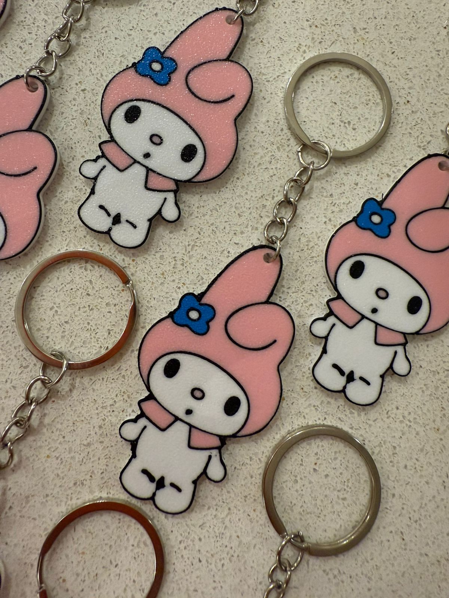

<!DOCTYPE html>
<html lang="es">
<head>
  <meta charset="UTF-8" />
  <meta name="viewport" content="width=device-width, initial-scale=1.0"/>
  <title>Layer Up - Catálogo 3D</title>
  
  
</head>
<body class="gradient-bg min-h-screen smooth-scroll">
  <!-- Header -->
  <header class="bg-white/80 backdrop-blur-md shadow-lg sticky top-0 z-50">
    

      

        <h1 class="text-2xl font-bold bg-gradient-to-r from-purple-400 to-pink-400 bg-clip-text text-transparent">Layer Up</h1>
        
Impresión 3D Personalizada

      

    

  </header>

  <!-- Categorías -->
  <nav class="py-4">
    

      

        <button onclick="scrollToCategory('llaveros')" class="category-card bg-pink-100 p-3 rounded-xl text-center shadow-lg">🔑 Llaveros</button>
        <button onclick="scrollToCategory('clickers')" class="category-card bg-blue-100 p-3 rounded-xl text-center shadow-lg">🎮 Clickers</button>
        <button onclick="scrollToCategory('figuras')" class="category-card bg-green-100 p-3 rounded-xl text-center shadow-lg">🎭 Figuras</button>
        <button onclick="scrollToCategory('sorpresas')" class="category-card bg-purple-100 p-3 rounded-xl text-center shadow-lg">🎁 Sorpresas</button>
        <button onclick="scrollToCategory('otros')" class="category-card bg-orange-100 p-3 rounded-xl text-center shadow-lg col-span-2">✨ Otros</button>
      

    

  </nav>

  <!-- Llaveros -->
  <section id="llaveros" class="py-4">
    

      <h2 class="text-lg font-bold text-center mb-4 text-pink-800">🔑 Llaveros</h2>
      

        
        
        
        
        
        
        
        
        
      

    

  </section>

  <!-- Clickers -->
  <section id="clickers" class="py-8 bg-white/50">
    

      <h2 class="text-2xl font-bold text-center mb-6 text-blue-800">🎮 Clickers</h2>
      

        
      

    

  </section>

  <!-- Figuras -->
  <section id="figuras" class="py-8">
    

      <h2 class="text-2xl font-bold text-center mb-6 text-green-800">🎭 Figuras</h2>
      
Próximamente…

    

  </section>

  <!-- Sorpresas -->
  <section id="sorpresas" class="py-8 bg-white/50">
    

      <h2 class="text-2xl font-bold text-center mb-6 text-purple-800">🎁 Sorpresas</h2>
      

        
        
        
      

    

  </section>

  <!-- Otros -->
  <section id="otros" class="py-8">
    

      <h2 class="text-2xl font-bold text-center mb-6 text-orange-800">✨ Otros</h2>
      

        
      

    

  </section>

  <!-- Footer -->
  <footer class="bg-gray-800 text-white py-6">
    

      <h3 class="text-lg font-bold mb-2">Layer Up</h3>
      
Transformamos tus ideas en realidad con impresión 3D de alta calidad

    

  </footer>

  <!-- WhatsApp Float Button -->
  <a href="https://wa.me/5491140928282" class="whatsapp-float bg-green-500 text-white p-3 rounded-full shadow-2xl" aria-label="WhatsApp">
    💬
  </a>

  
</body>
</html>
